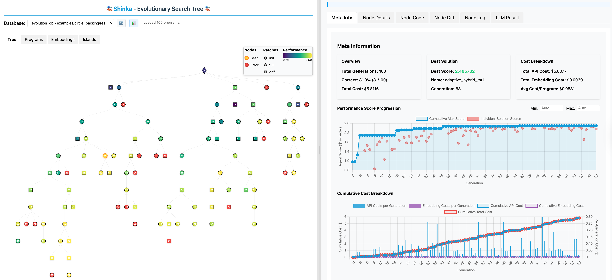

# Shinka WebUI Guide 🎨

The Shinka WebUI provides an interactive, real-time visualization of the evolutionary process, allowing you to monitor experiments, explore solution genealogies, and analyze performance metrics.

## Table of Contents

1. [Overview](#overview)
2. [Quick Start](#quick-start)
3. [Setup and Launch](#setup-and-launch)
4. [WebUI Features](#webui-features)
5. [Remote Access](#remote-access)
6. [Troubleshooting](#troubleshooting)
7. [Advanced Usage](#advanced-usage)

## Overview

The WebUI serves as a dashboard for monitoring Shinka evolution experiments, providing:

- **Real-time Updates**: Live monitoring of ongoing experiments
- **Evolution Tree**: Interactive visualization of solution genealogies
- **Performance Metrics**: Charts and graphs of fitness over generations
- **Code Diff Viewer**: Side-by-side comparison of evolved solutions
- **Island Visualization**: Multi-island evolution monitoring
- **Database Browser**: Explore archived solutions and metadata



## Quick Start

### Local Experiment

```bash
# Start your evolution experiment
shinka_launch variant=circle_packing_example

# In another terminal, launch the WebUI
shinka_visualize --port 8888 --open

# Or specify a results directory
shinka_visualize results_20241201_120000/ --port 8888 --open

# Or target a specific database file
shinka_visualize --db results_20241201_120000/evolution_db.sqlite --port 8888 --open

# Open browser to http://localhost:8888 (if not auto-opened)
```

### Remote Experiment

```bash
# On remote machine (where experiment runs)
shinka_visualize --port 8888

# On local machine (create SSH tunnel)
ssh -L 8888:localhost:8888 username@remote-host

# Open browser to http://localhost:8888
```

### Async Runner Support

The WebUI works seamlessly with both sync and async evolution runners:

```bash
# For async experiments
python run_evo_async.py  # Start async evolution

# Launch WebUI (auto-detects database in current directory)
shinka_visualize --open

# For sync experiments  
python run_evo.py        # Start sync evolution

# Launch WebUI with specific results directory
shinka_visualize results_20241201_120000/ --open

# Or with specific database file
shinka_visualize --db results_20241201_120000/evolution_db.sqlite --open
```

## Setup and Launch

### Prerequisites

The WebUI requires:
- Python 3.8+
- Access to the experiment's SQLite database
- Network access to the machine running the experiment

### Launch Options

#### Basic Launch
```bash
shinka_visualize
```

#### Custom Port
```bash
shinka_visualize --port 9000
```

#### Custom Database Path
```bash
shinka_visualize --db /path/to/evolution_db.sqlite
```

#### Auto-open Browser
```bash
shinka_visualize --open
```

#### Specify Results Directory
```bash
shinka_visualize /path/to/results_directory/ --port 8888 --open
```

### Command Line Arguments

| Argument | Default | Description |
|----------|---------|-------------|
| `root_directory` | Current directory | Root directory to search for database files |
| `-p, --port` | `8000` | Port for the web server |
| `--db` | Auto-detect | Path to specific SQLite database file |
| `--open` | `False` | Automatically open browser |

## WebUI Features

### 1. Evolution Tree Visualization

The evolution tree shows the genealogical relationships between solutions:

- **Nodes**: Individual solutions with fitness scores
- **Edges**: Parent-child relationships
- **Colors**: Performance-based color coding
- **Interactive**: Click nodes to view details
- **Filtering**: Filter by generation, island, or fitness

**Navigation:**
- **Zoom**: Mouse wheel or pinch gestures
- **Pan**: Click and drag
- **Select**: Click nodes to view details
- **Reset View**: Double-click empty space

### 2. Performance Metrics Dashboard

Track evolution progress with various metrics:

- **Fitness Over Time**: Line charts showing best/average fitness
- **Generation Statistics**: Distribution plots for each generation
- **Island Comparison**: Performance across different islands
- **Convergence Analysis**: Diversity and convergence metrics

**Available Metrics:**
- Best fitness per generation
- Average fitness per generation
- Population diversity measures
- Success rate of mutations
- Computational time per generation

### 3. Code Diff Viewer

Compare solutions to understand evolutionary changes:

- **Side-by-Side View**: Parent vs child code comparison
- **Syntax Highlighting**: Language-specific highlighting
- **Change Highlighting**: Added, removed, and modified lines
- **Diff Statistics**: Lines changed, complexity metrics
- **Navigation**: Jump between changes

**Features:**
- Unified or split view options
- Line-by-line change tracking
- Code complexity analysis
- Search within diffs

### 4. Solution Browser

Explore the archive of evolved solutions:

- **Search and Filter**: Find solutions by criteria
- **Sort Options**: By fitness, generation, or date
- **Metadata View**: Detailed solution information
- **Export Options**: Download solutions as files
- **Comparison Tools**: Compare multiple solutions

**Filter Options:**
- Generation range
- Fitness threshold
- Island ID
- Success status
- Code complexity

### 5. Island Visualization

For multi-island evolution experiments:

- **Island Overview**: Status and performance of each island
- **Migration Tracking**: Visualize solution migrations
- **Population Diversity**: Compare diversity across islands
- **Resource Usage**: Monitor computational resources per island

### 6. Real-time Updates

The WebUI automatically refreshes to show new data:

- **Live Refresh**: Configurable refresh intervals
- **Progress Indicators**: Show ongoing evaluations
- **Notifications**: Alerts for significant events
- **Auto-scroll**: Follow latest generations

## Remote Access

### SSH Tunneling

For experiments running on remote machines:

```bash
# Create SSH tunnel (local port 8888 -> remote port 8888)
ssh -L 8888:localhost:8888 username@remote-host

# For persistent connection
ssh -L 8888:localhost:8888 -N username@remote-host
```

### Cluster Access

For Slurm cluster experiments:

```bash
# Connect to cluster login node
ssh username@cluster-login-node

# Create tunnel through login node to compute node
ssh -L 8888:compute-node:8888 username@cluster-login-node

# Alternative: Direct tunnel if compute node is accessible
ssh -L 8888:localhost:8888 username@compute-node
```

### Multiple Experiments

Monitor multiple experiments simultaneously:

```bash
# Experiment 1 on port 8888
shinka_visualize exp1/ --port 8888

# Experiment 2 on port 8889  
shinka_visualize exp2/ --port 8889

# Or with specific database files
shinka_visualize --db exp1/evolution_db.sqlite --port 8888
shinka_visualize --db exp2/evolution_db.sqlite --port 8889

# Access at http://localhost:8888 and http://localhost:8889
```

## Troubleshooting

### Common Issues

#### 1. Database Not Found
```bash
# Error: Cannot find evolution_db.sqlite
# Solution: Specify database path explicitly
shinka_visualize --db /full/path/to/evolution_db.sqlite
```

#### 2. Port Already in Use
```bash
# Error: Address already in use
# Solution: Use different port
shinka_visualize --port 9000
```

#### 3. No Data Displayed
- **Check database**: Ensure experiment has started and created data
- **Verify path**: Confirm database path is correct
- **Check permissions**: Ensure read access to database file

#### 4. SSH Tunnel Issues
```bash
# Test tunnel connectivity
curl http://localhost:8888

# Debug SSH tunnel
ssh -v -L 8888:localhost:8888 username@remote-host
```

#### 5. Browser Connection Issues
- **Clear cache**: Hard refresh (Ctrl+F5 or Cmd+Shift+R)
- **Check firewall**: Ensure port is not blocked
- **Try different browser**: Some features require modern browsers

### Debug Mode

Enable verbose logging:

```bash
# Launch with verbose output (check console for debug info)
shinka_visualize --port 8888

# The server provides detailed logging in the console
```

### Performance Issues

For large experiments with many generations:

```bash
# For large experiments, the new shinka_visualize handles performance automatically
# Simply launch with your results directory
shinka_visualize large_experiment_results/ --port 8888 --open

# Or specify a specific database if needed
shinka_visualize --db large_experiment_results/evolution_db.sqlite --port 8888
```

## Advanced Usage

### Custom Styling

Modify the WebUI appearance by editing `viz_tree.html`:

```html
<!-- Custom CSS -->
<style>
.node-high-fitness { fill: #00ff00; }
.node-low-fitness { fill: #ff0000; }
</style>
```

### API Endpoints

The WebUI server provides REST API endpoints:

- `GET /api/generations`: List all generations
- `GET /api/generation/{id}`: Get specific generation data
- `GET /api/solutions/{id}`: Get solution details
- `GET /api/metrics`: Get performance metrics
- `GET /api/islands`: Get island information

### Embedding in Jupyter

Use the WebUI in Jupyter notebooks:

```python
from IPython.display import IFrame
import subprocess
import time

# Start WebUI server
subprocess.Popen(['shinka_visualize', '--port', '8888'])
time.sleep(2)  # Wait for server to start

# Embed in notebook
IFrame('http://localhost:8888', width=1000, height=600)
```

## Best Practices

### 1. Resource Management
- Monitor memory usage for large experiments
- Use appropriate refresh intervals
- Close unused browser tabs

### 2. Security
- Use SSH tunnels for remote access
- Don't expose WebUI ports publicly
- Limit access to trusted networks

### 3. Performance Optimization
- Reduce refresh frequency for large experiments
- Use filtering to focus on relevant data
- Close WebUI when not actively monitoring

### 4. Data Backup
- Regularly backup evolution databases
- Export important results before cleanup
- Keep logs of significant experiments

## WebUI Architecture

The WebUI consists of:

- **Backend Server**: Python HTTP server (`open_visualization.py`)
- **Frontend**: HTML/JavaScript visualization (`viz_tree.html`)
- **Database**: SQLite database with experiment data
- **Assets**: Icons, stylesheets, and images

For customization and development details, see the source code in the `webui/` directory.
